# Flujo de Estados — Sistema ISBA

Diagrama de secuencia completo: estados del incidente, sub-estados de `en_proceso` y visibilidad por rol en cada etapa.

> **Para previsualizar en VS Code:** instalar extensión [Markdown Preview Mermaid Support](https://marketplace.visualstudio.com/items?itemName=bierner.markdown-mermaid) y abrir con `Cmd+Shift+V` (Mac) o `Ctrl+Shift+V` (Win).

---

## Diagrama de secuencia completo

```mermaid
sequenceDiagram
    actor C as 👤 Cliente
    actor A as ⚙️ Admin
    actor T as 🔧 Técnico

    %% ─────────────────────────────────────────
    Note over C,T: ESTADO: pendiente
    %% ─────────────────────────────────────────

    C->>A: Reporta incidente
    Note over C: Ve pestaña "Pendiente" — sin acción posible
    Note over A: Card amarilla — Acción disponible: "Asignar técnico"
    Note over T: No ve el incidente aún

    %% ─────────────────────────────────────────
    Note over C,T: ESTADO: asignacion_solicitada
    %% ─────────────────────────────────────────

    A->>T: Asigna técnico (notificación in-app)
    Note over C: Ve pestaña "En proceso" — badge "Asignación en proceso"
    Note over A: Card azul — Acción: "Reasignar" si hay demora
    Note over T: Ve incidente en sección "Disponibles" — puede aceptar o rechazar

    alt Técnico rechaza
        T-->>A: Rechaza la asignación
        Note over A: Incidente vuelve a asignacion_solicitada — puede reasignar
    end

    %% ─────────────────────────────────────────
    Note over C,T: ESTADO: en_proceso — SUB-ESTADO 1: pendiente_inspeccion
    %% ─────────────────────────────────────────

    T->>A: Acepta la asignación
    Note over C: Ve grupo "En curso" — label "Trabajo en progreso" (no distingue sub-estado)
    Note over A: Badge gris — "Pend. inspección" — botón disabled, sin acción
    Note over T: Ve botón activo "Ir a Inspección" → abre tab inspecciones del modal

    %% ─────────────────────────────────────────
    Note over C,T: ESTADO: en_proceso — SUB-ESTADO 2: aceptada → "Pend. presupuesto"
    %% ─────────────────────────────────────────

    T->>A: Carga la inspección del inmueble en el sistema
    Note over C: Ve grupo "En curso" — label "Trabajo en progreso" (no distingue sub-estado)
    Note over A: Badge gris — "Pend. presupuesto" — botón disabled, sin acción
    Note over T: Ve botón activo "Cargar presup." → abre tab presupuesto del modal

    %% ─────────────────────────────────────────
    Note over C,T: ESTADO: en_proceso — SUB-ESTADO 3: presupuesto_enviado
    %% ─────────────────────────────────────────

    T->>A: Envía presupuesto (materiales + mano de obra + descripción)
    Note over C: Ve grupo "En curso" — label "Trabajo en progreso" (no distingue sub-estado)
    Note over A: Badge ámbar — "Evaluar presup." — botón ACTIVO 🔔 → abre modal de revisión
    Note over T: Ve badge "Pend. cliente" — disabled, espera al admin

    alt Admin rechaza presupuesto (1er presupuesto)
        A-->>C: Incidente vuelve a estado "pendiente" — admin reasigna técnico
    end

    A->>T: Aprueba presupuesto internamente (agrega gastos administrativos)

    %% ─────────────────────────────────────────
    Note over C,T: ESTADO: en_proceso — SUB-ESTADO 4: presupuesto_cliente
    %% ─────────────────────────────────────────

    Note over C: Ve grupo "Aguarda aprobación del cliente" — botón ACTIVO: "Aprobar presup." 🔔
    Note over A: Badge amarillo — "Esp. cliente" — disabled, espera al cliente
    Note over T: Ve badge "Pend. cliente" — disabled, espera al cliente

    alt Cliente rechaza con "nuevo_tecnico"
        C-->>A: Incidente vuelve a pendiente — admin reasigna
    end
    alt Cliente rechaza con "otra_oportunidad"
        C-->>T: Técnico recibe notificación — puede reenviar nuevo presupuesto
    end

    C->>T: Aprueba presupuesto

    %% ─────────────────────────────────────────
    Note over C,T: ESTADO: en_proceso — SUB-ESTADO 5: en_curso
    %% ─────────────────────────────────────────

    Note over C: Ve grupo "En curso" — label "Trabajo en progreso" — sin acción
    Note over A: Badge verde — "En curso" — disabled, sin acción
    Note over T: Ve botón activo "Subir conform." → abre tab conformidad del modal

    alt Técnico cancela asignación (penalización 1★)
        T-->>A: Incidente vuelve a pendiente — admin reasigna
    end

    T->>A: Marca trabajo como completado + sube foto de conformidad firmada

    %% ─────────────────────────────────────────
    Note over C,T: ESTADO: en_proceso — SUB-ESTADO 6: completada_pendiente → "Conf. subida"
    %% ─────────────────────────────────────────

    Note over C: Ve grupo "Conf. para revisar" — sin acción
    Note over A: Badge violeta — "Ver conform." — botón ACTIVO 🔔 → abre modal con foto
    Note over T: Ve badge "Por revisar" — disabled, espera al admin

    alt Admin rechaza conformidad (foto ilegible, incompleta, etc.)

        %% ─────────────────────────────────────────
        Note over C,T: ESTADO: en_proceso — SUB-ESTADO 7: conformidad_rechazada
        %% ─────────────────────────────────────────

        A-->>T: Rechaza la conformidad
        Note over C: Ve grupo "En curso" — NO ve este sub-estado en la lista
        Note over A: Badge rojo — "Conf. rechazada" — disabled (máxima prioridad visual)
        Note over T: Ve botón activo "Resubir" → abre tab conformidad del modal

        T->>A: Reenvía nueva foto de conformidad
        Note over C,T: Vuelve a SUB-ESTADO 6: completada_pendiente
    end

    A->>C: Aprueba conformidad

    %% ─────────────────────────────────────────
    Note over C,T: ESTADO: finalizado
    %% ─────────────────────────────────────────

    Note over C: Ve pestaña "Finalizados" — puede ver el historial
    Note over A: Card verde — puede registrar cobro al cliente y pago al técnico
    Note over T: Ve trabajo en historial — puede ver el cobro registrado

    A->>C: Registra cobro al cliente (OBLIGATORIO antes del pago al técnico)
    A->>T: Registra pago al técnico
```



---

## Tabla de visibilidad por rol

### Estados principales del incidente

| Estado | Cliente ve | Admin ve | Técnico ve |
|--------|-----------|----------|------------|
| `pendiente` | "Pendiente" — sin acción | Card amarilla — **Asignar técnico** | Nada |
| `asignacion_solicitada` | "En proceso" — sin acción | Card azul — **Reasignar** si demora | Incidente en "Disponibles" — **Aceptar / Rechazar** |
| `en_proceso` | Según sub-estado (ver abajo) | Según sub-estado (ver abajo) | Según sub-estado (ver abajo) |
| `finalizado` | Historial de incidente | Card verde — **Cobrar** / **Pagar técnico** | Historial de trabajos |

### Sub-estados de `en_proceso`

| # | Key | Label en UI | Cliente | Admin | Técnico |
|---|-----|------------|---------|-------|---------|
| 1 | `pendiente_inspeccion` | Pend. inspección | "En curso" (no distingue) | Badge gris — sin acción | **Ir a Inspección** |
| 2 | `aceptada` | Pend. presupuesto | "En curso" (no distingue) | Badge gris — sin acción | **Cargar presup.** |
| 3 | `presupuesto_enviado` | Presup. enviado | "En curso" (no distingue) | **Evaluar presup.** 🔔 | Badge disabled |
| 4 | `presupuesto_cliente` | Esp. cliente | **Aprobar presup.** 🔔 | Badge disabled | Badge disabled |
| 5 | `en_curso` | En curso | "Trabajo en progreso" | Badge disabled | **Subir conform.** |
| 6 | `completada_pendiente` | Conf. subida | "Conf. para revisar" | **Ver conform.** 🔔 | Badge disabled |
| 7 | `conformidad_rechazada` | Conf. rechazada | No visible en lista | Badge rojo — sin acción | **Resubir** |

> **Nota:** Los sub-estados 1, 2 y 3 son invisibles para el cliente. Los tres aparecen agrupados como "En curso / Trabajo en progreso". El sub-estado 7 tampoco es visible para el cliente en la lista; solo aparece en el timeline interno del incidente.

---

## Cómo se calcula el sub-estado (no hay campo en DB)

El sub-estado se deriva en runtime combinando tres fuentes:

```
estado_asignacion   +   estado_presupuesto   +   conformidad
(asignacion activa)     (presupuesto si existe)   (esta_rechazada / url_documento)
```

| Función | Rol | Archivo |
|---------|-----|---------|
| `getAccionPendiente()` | Admin | `components/admin/incidentes-content.client.tsx` |
| `getStatusKey()` | Técnico | `components/tecnico/trabajos-content.client.tsx` |
| array `grupos` inline | Cliente | `components/cliente/incidentes-content.client.tsx` |

**Fuente canónica del type y config visual:** `shared/utils/colors.ts` → `SubEstadoEnProceso` y `SUB_ESTADO_EN_PROCESO_CONFIG`
