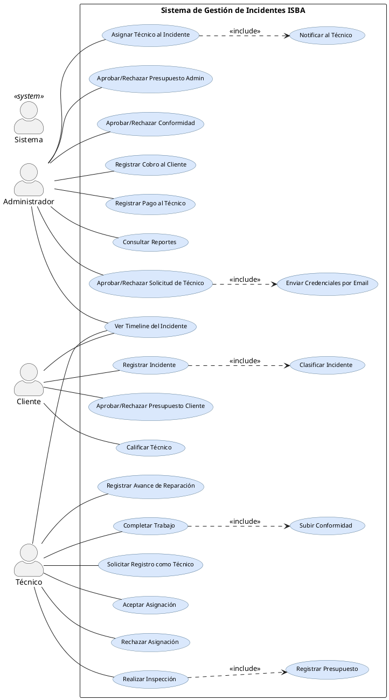
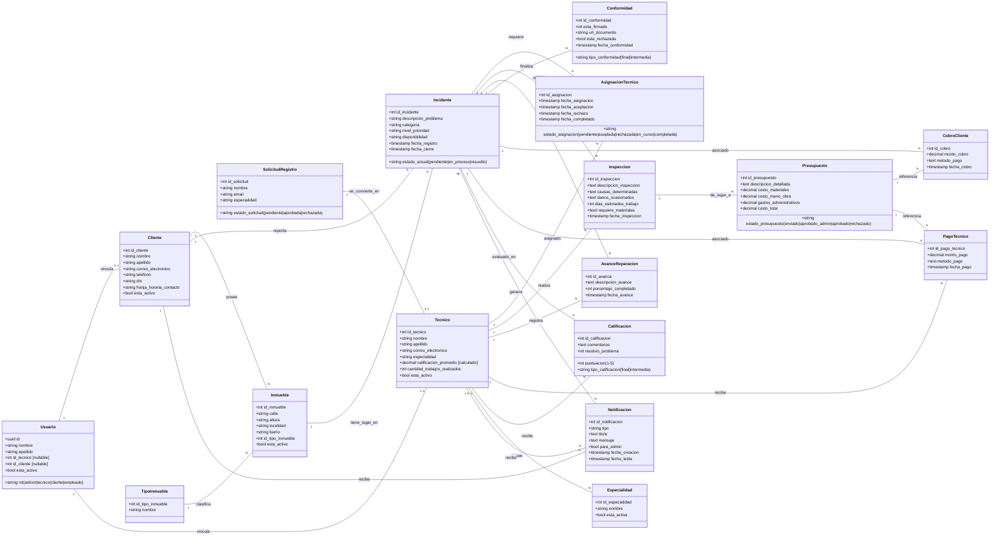
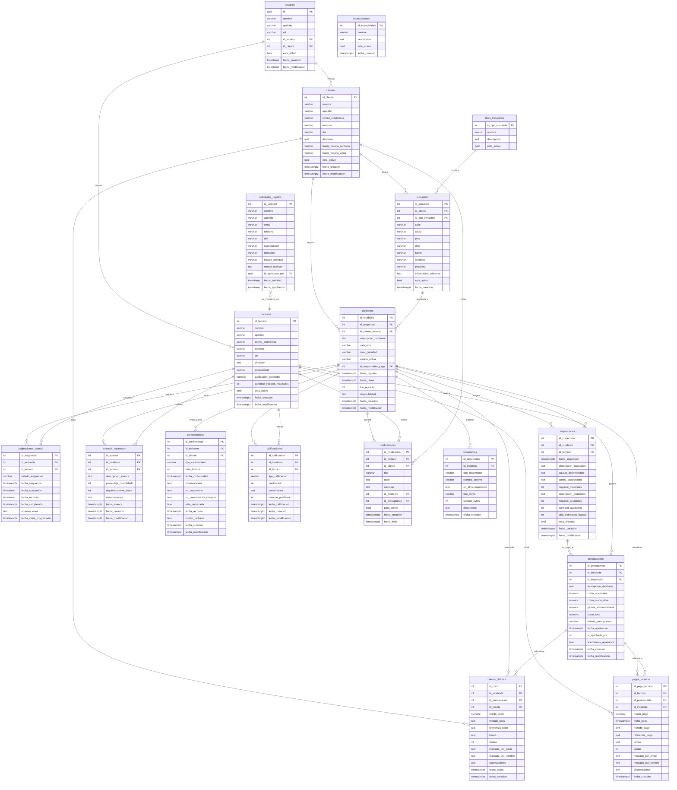

# Documentación del Sistema de Gestión de Incidentes — ISBA
> **Versión actualizada:** Abril 2026  
> Refleja el estado real del sistema implementado.

---

## Índice

- [6.3 Épica](#63-épica)
- [6.4 Diagrama de Casos de Uso](#64-diagrama-de-casos-de-uso)
- [6.5 Código PlantUML del Diagrama de Casos de Uso](#65-código-plantuml-del-diagrama-de-casos-de-uso)
- [6.6 Descripciones de Casos de Uso](#66-descripciones-de-casos-de-uso)
- [6.7 Documentación Diagrama BPMN](#67-documentación-diagrama-bpmn)
- [6.8 Diagrama BPMN](#68-diagrama-bpmn)
- [6.9 Diagrama de Dominio](#69-diagrama-de-dominio)
- [6.10 Base de Datos (DER)](#610-base-de-datos-der)
- [6.11 Arquitectura del Sistema](#611-arquitectura-del-sistema)

---

## 6.3 Épica

### EP-01 – Gestión Integral de Incidentes y Reparaciones de Propiedades

El sistema permite gestionar integralmente los incidentes vinculados a las propiedades administradas, abarcando desde el registro inicial —realizado por el propio cliente mediante su portal web— hasta el cierre del incidente, garantizando el seguimiento de la información, la comunicación entre todos los intervinientes (administración, técnicos y clientes) y la generación de reportes que permitan evaluar la calidad y eficiencia del servicio.

**Objetivo de negocio:**  
Optimizar la administración de incidentes y reparaciones, reduciendo los tiempos de resolución, mejorando la comunicación entre las áreas y asegurando la calidad del servicio brindado por los técnicos. La incorporación de un portal propio para clientes elimina la intermediación manual en el reporte de incidentes y en la aprobación de presupuestos.

**Criterios de éxito:**
- Los clientes registran sus propios reclamos a través del portal web, en cualquier momento y desde cualquier dispositivo.
- Cada reclamo posee técnico asignado, seguimiento de avances, cobro al cliente y pago al técnico registrados.
- El cliente puede ver el estado de su incidente en tiempo real a través de una línea de tiempo (timeline).
- El cliente aprueba o rechaza el presupuesto directamente desde su portal.
- El sistema genera 12 reportes de desempeño, calidad, financieros y satisfacción.
- Los accesos están restringidos según cuatro roles: Administrador, Técnico, Cliente y Empleado.
- El sistema es accesible desde dispositivos móviles y de escritorio (diseño responsive).
- Las notificaciones y contadores de alerta se actualizan en tiempo real mediante suscripciones Realtime.

---

### Historias de Usuario

| ID | Historia de Usuario | Criterios de Aceptación |
|----|--------------------|-----------------------|
| HU-01 | Como **cliente**, quiero registrar un incidente indicando mi inmueble, la descripción del problema y mi disponibilidad horaria, para iniciar el proceso de resolución sin depender de la administración. | El sistema permite ingresar los datos del incidente desde el portal del cliente y genera un legajo digital vinculado al inmueble. (RF-01) |
| HU-02 | Como **administrador**, quiero clasificar los incidentes por categoría y prioridad, para gestionarlos de forma ordenada y eficiente. | El sistema permite establecer y modificar los criterios de clasificación. (RF-02) |
| HU-03A | Como **administrador**, quiero asignar un técnico disponible según su especialidad y ranking de desempeño, para garantizar que cada incidente sea atendido por el profesional más adecuado. | El sistema muestra la disponibilidad y especialidad de los técnicos registrados. (RF-03, RF-11) |
| HU-03B | Como **administrador**, quiero que al asignar un técnico, este quede notificado automáticamente con un badge en tiempo real, para agilizar la respuesta. | El sistema envía una notificación al técnico seleccionado y actualiza el contador de alertas en el sidebar. (RF-04) |
| HU-04 | Como **técnico**, quiero aceptar o rechazar la asignación recibida, para confirmar mi disponibilidad para realizar la reparación. | El sistema registra la respuesta del técnico y actualiza el estado de la asignación. (RF-04) |
| HU-05 | Como **técnico**, quiero registrar la inspección técnica del inmueble e ingresar el presupuesto correspondiente, para formalizar el diagnóstico y los costos de reparación. | El sistema permite cargar los datos de inspección y el presupuesto, asociándolos al incidente. (RF-05) |
| HU-06A | Como **administrador**, quiero revisar y aprobar o rechazar el presupuesto cargado por el técnico, para autorizar o denegar la ejecución del trabajo. | El sistema registra la decisión del administrador y actualiza el estado del presupuesto. (RF-06) |
| HU-06B | Como **cliente**, quiero recibir el presupuesto aprobado por la administración y decidir si aprobarlo o rechazarlo, para tener control sobre los costos de mi reparación. | El sistema muestra el presupuesto con su detalle en el portal del cliente y registra su decisión. (RF-06) |
| HU-07A | Como **técnico**, quiero registrar los avances del trabajo realizado, para mantener actualizada la información del incidente. | El sistema permite registrar avances con descripción, porcentaje completado y fecha. Los avances registrados son visibles en la pestaña de ejecución y en el timeline. (RF-07A) |
| HU-07B | Como **administrador**, quiero visualizar el estado de cada incidente mediante una línea de tiempo completa, para hacer seguimiento de todo el proceso. | El sistema presenta el timeline con todos los eventos: creación, asignación, inspección, presupuesto, avances, pagos y conformidad. (RF-07A) |
| HU-07C | Como **cliente**, quiero ver el timeline de mi incidente desde mi portal, para saber en qué etapa se encuentra mi reparación. | El sistema muestra al cliente los eventos relevantes de su incidente (registro, asignación, presupuesto, pago, conformidad) con navegación entre pestañas dentro del mismo modal. (RF-07A) |
| HU-08A | Como **administrador**, quiero registrar el cobro al cliente, para mantener la trazabilidad financiera del incidente. | El sistema permite registrar el monto, fecha y método de pago recibido. (RF-07B) |
| HU-08B | Como **administrador**, quiero registrar el pago al técnico, para completar el circuito administrativo de la reparación. | El sistema permite registrar fecha, monto y técnico pagado. (RF-07C) |
| HU-09 | Como **técnico**, quiero dejar constancia de la conformidad del cliente con el trabajo realizado, para validar que la reparación se completó correctamente. | El sistema permite registrar y subir la foto/documento de conformidad. (RF-07D) |
| HU-10 | Como **administrador**, quiero revisar y aprobar o rechazar la conformidad subida por el técnico, para cerrar formalmente el incidente. | El sistema muestra la documentación de conformidad y registra la decisión. La aprobación pasa el incidente a estado "resuelto". (RF-08) |
| HU-11 | Como **cliente**, quiero calificar al técnico una vez resuelto mi incidente, para brindar retroalimentación sobre la calidad del servicio. | El sistema permite al cliente ingresar una puntuación (1-5 estrellas) y comentario, actualizando el historial del técnico. (RF-09) |
| HU-12 | Como **administrador**, quiero gestionar el alta, baja y modificación de técnicos, para mantener actualizado el registro de prestadores. | El sistema gestiona solicitudes de registro enviadas por los propios técnicos. El admin aprueba la solicitud y el sistema genera una contraseña temporal enviada por email. (RF-11) |
| HU-13 | Como **administrador**, quiero consultar 12 reportes de desempeño, financieros y de satisfacción, para evaluar la calidad del servicio. | El sistema genera reportes con filtros de fecha, exportación a CSV y PDF. (RF-12) |

---

## 6.4 Diagrama de Casos de Uso

El sistema cuenta con cuatro actores principales:

- **Administrador**: gestión completa del sistema (incidentes, asignaciones, presupuestos, pagos, técnicos, reportes).
- **Cliente**: registro de incidentes, consulta de estado, aprobación de presupuesto, calificación de técnico.
- **Técnico**: respuesta a asignaciones, inspección, presupuesto, avances, conformidad.
- **Sistema**: acciones automáticas (notificaciones, actualización de estados, envío de emails).

---

## 6.5 Código PlantUML del Diagrama de Casos de Uso



---

## 6.6 Descripciones de Casos de Uso

### 6.6.1 Gestión de Técnicos

#### UC: Solicitar Registro como Técnico
**Relacionado con:** HU-12, RF-11  
**Descripción:** El técnico completa un formulario de solicitud de registro con sus datos personales, especialidades, DNI y contacto. La solicitud queda en estado "pendiente" hasta que el administrador la apruebe. El técnico no puede acceder al sistema hasta recibir la aprobación.

**Actores:** Técnico  
**Flujo Principal:**
1. El técnico accede a la página de registro y selecciona la pestaña "Técnico".
2. Completa nombre, apellido, email, teléfono, DNI, dirección y especialidades.
3. El sistema inserta la solicitud en estado `pendiente`.
4. El técnico recibe confirmación de que su solicitud fue enviada y está en revisión.

**Postcondiciones:** Se crea una solicitud en `solicitudes_registro` con estado `pendiente`.

---

#### UC: Aprobar/Rechazar Solicitud de Técnico
**Relacionado con:** HU-12, RF-11  
**Descripción:** El administrador revisa las solicitudes pendientes de técnicos. Al aprobar, el sistema crea automáticamente la cuenta en Supabase Auth con una contraseña temporal generada por el sistema, y envía al técnico un email con sus credenciales de acceso. En el primer login, el técnico está obligado a cambiar su contraseña.

**Actores:** Administrador  
**Flujo Principal:**
1. El administrador accede a `/dashboard/tecnicos` → pestaña "Solicitudes".
2. El sistema muestra las solicitudes pendientes con nombre, email y especialidades.
3. El administrador selecciona "Aprobar" en una solicitud.
4. El sistema genera una contraseña temporal segura.
5. El sistema crea el usuario en Supabase Auth con `must_change_password: true`.
6. El sistema inserta el registro en `tecnicos` y `usuarios` (rol=`tecnico`).
7. El sistema envía un email al técnico con sus credenciales de acceso.
8. El sistema actualiza la solicitud a estado `aprobada`.

**Flujo Alternativo (Rechazo):**
- El administrador selecciona "Rechazar" → la solicitud pasa a estado `rechazada`.

**Postcondiciones:** El técnico tiene cuenta activa y puede iniciar sesión; recibe email con credenciales temporales.

---

### 6.6.2 Flujo Principal del Incidente

#### UC: Registrar Incidente
**Relacionado con:** HU-01, RF-01  
**Descripción:** El cliente, desde su portal, registra un nuevo incidente seleccionando el inmueble afectado, describiendo el problema y especificando su disponibilidad horaria. El sistema genera un legajo digital único. El registro lo realiza el propio cliente sin intermediación de la administración.

**Actores:** Cliente  
**Flujo Principal:**
1. El cliente accede a `/cliente/incidentes/nuevo`.
2. El sistema carga los inmuebles activos asociados al cliente.
3. El cliente selecciona el inmueble, describe el problema y establece su disponibilidad.
4. El sistema inserta el incidente en estado `pendiente`.
5. El sistema redirige al cliente a la lista de sus incidentes.

**Precondiciones:** El cliente debe estar autenticado y tener al menos un inmueble registrado.  
**Postcondiciones:** Se crea un incidente en estado `pendiente` y el administrador lo ve reflejado en su panel con el badge correspondiente.

---

#### UC: Clasificar Incidente
**Relacionado con:** HU-02, RF-02  
**Descripción:** El administrador analiza el incidente, asigna una categoría (plomería, electricidad, gas, etc.) y un nivel de prioridad para organizar la gestión.

**Actores:** Administrador  
**Flujo Principal:**
1. El administrador accede al detalle del incidente pendiente.
2. Asigna categoría y prioridad.
3. El sistema guarda la clasificación.

---

#### UC: Asignar Técnico al Incidente
**Relacionado con:** HU-03A, HU-03B, RF-03, RF-04  
**Descripción:** El administrador selecciona un técnico disponible de la lista filtrada por especialidad y lo asigna al incidente. El sistema notifica automáticamente al técnico mediante una notificación en tiempo real (badge en su panel) y actualiza el estado del incidente.

**Actores:** Administrador  
**Flujo Principal:**
1. El administrador accede al incidente pendiente.
2. Selecciona "Gestionar" y elige el técnico más adecuado.
3. El sistema inserta la asignación en estado `pendiente`.
4. El sistema actualiza el incidente a estado `en_proceso`.
5. El sistema genera una notificación para el técnico.
6. El badge de asignaciones pendientes del técnico se actualiza en tiempo real (Realtime).

**Postcondiciones:** La asignación queda en estado `pendiente`; el técnico es notificado.

---

#### UC: Aceptar Asignación
**Relacionado con:** HU-04, RF-04  
**Descripción:** El técnico revisa la asignación recibida y confirma su disponibilidad. Al aceptar, la asignación pasa a estado `aceptada` y el administrador recibe una notificación.

**Actores:** Técnico  
**Flujo Principal:**
1. El técnico accede a `/tecnico/disponibles`.
2. Revisa los detalles del incidente (dirección, descripción, datos del cliente).
3. Selecciona "Aceptar".
4. El sistema actualiza la asignación a `aceptada`.
5. El sistema notifica al administrador.

**Postcondiciones:** El incidente queda asignado al técnico, quien puede comenzar la inspección.

---

#### UC: Rechazar Asignación
**Relacionado con:** HU-04, RF-04  
**Descripción:** El técnico rechaza la asignación si no tiene disponibilidad. El sistema libera la asignación para que el administrador pueda asignar otro técnico.

**Actores:** Técnico  
**Flujo Principal:**
1. El técnico selecciona "Rechazar" en la asignación recibida.
2. El sistema actualiza la asignación a `rechazada`.
3. El sistema notifica al administrador que debe reasignar.
4. El incidente muestra un banner de "solicitud rechazada — reasignar técnico" en el panel del admin.

**Postcondiciones:** El incidente queda disponible para reasignación.

---

#### UC: Realizar Inspección
**Relacionado con:** HU-05, RF-05  
**Descripción:** El técnico visita el inmueble, registra el diagnóstico técnico: descripción, causas determinadas, daños ocasionados, materiales requeridos, cantidad de ayudantes y días estimados de trabajo.

**Actores:** Técnico  
**Flujo Principal:**
1. El técnico accede al incidente aceptado desde `/tecnico/trabajos`.
2. Accede a la pestaña "Inspecciones" del modal de detalle.
3. Completa los campos del formulario de inspección.
4. El sistema registra la inspección vinculada al incidente y al técnico.
5. La inspección queda disponible como base para el presupuesto.

---

#### UC: Registrar Presupuesto
**Relacionado con:** HU-05, RF-05  
**Descripción:** El técnico elabora el presupuesto basado en la inspección, indicando costo de materiales, mano de obra y una descripción detallada. Al enviar, el presupuesto pasa a estado `enviado` y el administrador recibe una notificación para su revisión.

**Actores:** Técnico  
**Flujo Principal:**
1. El técnico accede a la pestaña "Presupuesto" del modal de detalle.
2. Ingresa descripción, costo de materiales y costo de mano de obra.
3. El sistema calcula el costo total.
4. El técnico envía el presupuesto.
5. El presupuesto pasa a estado `enviado`.
6. El badge de presupuestos pendientes del admin se actualiza en tiempo real.

---

#### UC: Aprobar/Rechazar Presupuesto (Administrador)
**Relacionado con:** HU-06A, RF-06  
**Descripción:** El administrador revisa el presupuesto enviado por el técnico, define los gastos administrativos (comisión ISBA) y lo aprueba para enviarlo al cliente, o lo rechaza para que el técnico lo revise.

**Actores:** Administrador  
**Flujo Principal:**
1. El administrador accede a `/dashboard/presupuestos/aprobar`.
2. Revisa los datos del presupuesto (materiales, mano de obra, descripción).
3. Ingresa los gastos administrativos.
4. Selecciona "Aprobar" → el presupuesto pasa a `aprobado_admin`.
5. El cliente recibe la notificación para revisar el presupuesto.

**Flujo Alternativo (Rechazo):**
- El administrador selecciona "Rechazar" → el presupuesto pasa a `rechazado`. El técnico es notificado para enviar uno nuevo.

---

#### UC: Aprobar/Rechazar Presupuesto (Cliente)
**Relacionado con:** HU-06B, RF-06  
**Descripción:** El cliente, desde su portal, revisa el presupuesto aprobado por la administración y decide si autoriza la ejecución del trabajo. Su decisión determina si el incidente avanza a ejecución o se cierra.

**Actores:** Cliente  
**Flujo Principal:**
1. El cliente ve el badge de "Presupuesto" en la tarjeta de su incidente.
2. Abre el modal del incidente en la pestaña "Presupuesto".
3. Revisa el detalle: descripción, materiales, mano de obra, gastos administrativos y total.
4. Selecciona "Aprobar" → el presupuesto pasa a `aprobado`.
5. El técnico queda habilitado para iniciar la ejecución.

**Flujo Alternativo (Rechazo):**
- El cliente selecciona "Rechazar" → el presupuesto pasa a `rechazado`. El admin es notificado.

---

#### UC: Registrar Avance de Reparación
**Relacionado con:** HU-07A, RF-07A  
**Descripción:** El técnico registra los avances del trabajo realizados, indicando una descripción y opcionalmente el porcentaje completado. Los avances son visibles en la pestaña de ejecución del modal (con lista de avances anteriores) y se incorporan al timeline del incidente.

**Actores:** Técnico  
**Flujo Principal:**
1. El técnico accede al incidente con presupuesto aprobado.
2. Accede a la pestaña "Ejecución" del modal de detalle.
3. La sección muestra los avances ya registrados (descripción, fecha, porcentaje).
4. El técnico completa la descripción del nuevo avance.
5. El sistema inserta el avance en `avances_reparacion`.
6. La lista de avances y el timeline se actualizan automáticamente sin cerrar el modal.

**Postcondiciones:** El avance queda visible para el técnico en la pestaña "Ejecución" y para todos en el timeline.

---

#### UC: Completar Trabajo y Subir Conformidad
**Relacionado con:** HU-09, RF-07D  
**Descripción:** El técnico marca el trabajo como completado y sube la foto/documento de conformidad firmado por el cliente. El administrador recibe una notificación para revisar la conformidad.

**Actores:** Técnico  
**Flujo Principal:**
1. El técnico accede a la pestaña "Ejecución" y confirma la finalización del trabajo.
2. La asignación pasa a estado `completada`.
3. El técnico sube la foto de conformidad en la pestaña "Conformidad".
4. Opcionalmente adjunta el comprobante de compras de materiales.
5. El administrador recibe notificación para revisar la conformidad.

---

#### UC: Aprobar/Rechazar Conformidad
**Relacionado con:** HU-10, RF-08  
**Descripción:** El administrador revisa la conformidad subida por el técnico, verifica el documento y registra la calificación del técnico. Al aprobar, el incidente pasa a estado `resuelto`.

**Actores:** Administrador  
**Flujo Principal:**
1. El administrador accede a `/dashboard/conformidades`.
2. Selecciona la conformidad pendiente y revisa la documentación.
3. Revisa el historial completo del incidente (timeline integrado).
4. Asigna puntuación (1-5 estrellas) y comentarios opcionales.
5. Selecciona "Aprobar y calificar" → el incidente pasa a `resuelto`.
6. El badge de conformidades del sidebar se actualiza en tiempo real.

**Flujo Alternativo (Rechazo):**
- El administrador rechaza la conformidad → el técnico debe subir una nueva foto.

---

#### UC: Calificar Técnico
**Relacionado con:** HU-11, RF-09  
**Descripción:** Una vez resuelto el incidente, el cliente puede calificar al técnico desde su portal indicando una puntuación de 1 a 5 estrellas y un comentario. Esta calificación actualiza el promedio del técnico.

**Actores:** Cliente  
**Flujo Principal:**
1. El cliente ve el incidente en estado "resuelto".
2. Accede a la pestaña "Calificar" del modal del incidente.
3. Selecciona su puntuación y agrega un comentario opcional.
4. El sistema registra la calificación y actualiza `calificacion_promedio` del técnico.

---

### 6.6.3 Casos de Uso Financieros

#### UC: Registrar Cobro al Cliente
**Relacionado con:** HU-08A, RF-07B  
**Descripción:** El administrador registra el cobro al cliente, indicando monto, método de pago (efectivo, transferencia, débito, crédito), datos del comprobante y observaciones.

**Actores:** Administrador  
**Flujo Principal:**
1. El administrador accede a `/dashboard/pagos` → pestaña "Cobros a Clientes".
2. Selecciona el cobro pendiente y accede al formulario.
3. Ingresa método de pago y datos del comprobante.
4. El sistema registra el cobro en `cobros_clientes`.
5. El badge de pagos pendientes del sidebar se actualiza.

---

#### UC: Registrar Pago al Técnico
**Relacionado con:** HU-08B, RF-07C  
**Descripción:** El administrador registra el pago al técnico por el trabajo realizado, indicando monto, método de pago y comprobante.

**Actores:** Administrador  
**Flujo Principal:**
1. El administrador accede a `/dashboard/pagos` → pestaña "Pagos a Técnicos".
2. Selecciona el pago pendiente.
3. Puede revisar el historial del incidente antes de confirmar.
4. Ingresa método de pago y datos del comprobante.
5. El sistema registra el pago en `pagos_tecnicos`.

---

#### UC: Ver Timeline del Incidente
**Relacionado con:** HU-07B, HU-07C, RF-07A  
**Descripción:** Todos los roles pueden consultar la línea de tiempo del incidente. Muestra de forma cronológica todos los eventos: registro, asignación (y su aceptación/rechazo), inspección, presupuesto (con cada cambio de estado), avances de reparación, pagos y conformidad. Cada evento es expandible para ver su detalle completo.

**Actores:** Administrador, Cliente, Técnico  
**Diferencia por rol:**
- **Cliente**: ve los eventos que le conciernen (registro, asignación, presupuesto, pago, conformidad). Puede navegar entre las pestañas Detalles / Timeline / Presupuesto / Calificar sin cerrar el modal.
- **Técnico**: ve todos los eventos incluyendo los avances que registró.
- **Administrador**: ve el flujo completo con todos los detalles.

---

#### UC: Consultar Reportes
**Relacionado con:** HU-13, RF-12  
**Descripción:** El administrador accede a 12 reportes analíticos con filtros de fecha, exportación a CSV y generación de PDF imprimible.

**Actores:** Administrador  
**Reportes disponibles:**
| # | Nombre |
|---|--------|
| R1 | Incidentes por mes |
| R2 | Distribución por categoría |
| R3 | Tiempo promedio de resolución |
| R4 | Incidentes por técnico |
| R5 | Rentabilidad por categoría |
| R6 | Desempeño de técnicos |
| R7 | Calificaciones promedio |
| R8 | Satisfacción del cliente |
| R10 | Ingresos mensuales |
| R11 | Presupuestos por estado |
| R12 | Técnicos más activos |
| R13 | Medios de pago utilizados |

---

## 6.7 Documentación Diagrama BPMN

### 1. ABM de Inmuebles

**Objetivo:** Establecer el inventario de inmuebles administrados, creando el registro maestro para la vinculación de clientes e incidentes.

**Entradas:** Datos del inmueble (dirección, localidad, barrio, tipo), selección del cliente propietario.

**Actividades:**
- Registro de datos del inmueble en el sistema.
- Asociación del inmueble con el cliente correspondiente.
- Activación/desactivación del inmueble.

**Salidas:** Registro del inmueble en la base de datos, vinculado al cliente.  
**Relación con otros procesos:** Base para el registro de incidentes.

---

### 2. Alta de Clientes

**Objetivo:** Registrar a los clientes que accederán al portal para reportar y hacer seguimiento de sus incidentes.

**Entradas:** Datos personales (nombre, apellido, email, teléfono, DNI, disponibilidad de contacto).

**Actividades:**
- El cliente completa el formulario de registro en `/register`.
- Supabase Auth crea la cuenta de usuario.
- Un trigger de base de datos inserta automáticamente el registro en `clientes` y `usuarios` (rol=`cliente`).
- El cliente queda habilitado para acceder al portal.

**Salidas:** Cuenta activa en el sistema, perfil de cliente creado.  
**Relación con otros procesos:** Habilita el registro de incidentes e inmuebles.

---

### 3. Alta de Técnicos

**Objetivo:** Incorporar prestadores de servicio técnico al sistema, con verificación por parte de la administración.

**Entradas:** Solicitud del técnico (nombre, apellido, email, DNI, especialidades, dirección).

**Actividades:**
- El técnico completa el formulario de solicitud de registro en `/register`.
- La solicitud queda en estado `pendiente` en `solicitudes_registro`.
- El administrador revisa la solicitud en el panel de gestión.
- Al aprobar: el sistema genera una contraseña temporal, crea la cuenta en Supabase Auth, inserta el registro en `tecnicos` y `usuarios`, y envía el email con credenciales.
- En el primer login, el sistema obliga al técnico a cambiar su contraseña.

**Salidas:** Cuenta activa del técnico, registro en `tecnicos`, email con credenciales.  
**Relación con otros procesos:** La disponibilidad y especialidades del técnico son la entrada clave para el proceso de asignación.

---

### 4. Gestión de Especialidades

**Objetivo:** Mantener el catálogo de especialidades técnicas disponibles para la clasificación de incidentes y filtrado de técnicos.

**Actividades:** El administrador puede agregar, modificar o desactivar especialidades desde el panel de configuración.

---

### 5. Alta de Incidentes (Inicio del Proceso)

**Objetivo:** Iniciar formalmente el ciclo de atención del incidente.

**Entradas:**
- Datos del cliente (autenticado en el sistema).
- Selección del inmueble afectado.
- Descripción del problema.
- Disponibilidad horaria para contacto/visita.

**Actividades:**
- El cliente completa el formulario de nuevo incidente desde su portal.
- El sistema inserta el incidente en estado `pendiente`.
- El administrador ve el nuevo incidente en su panel con el badge actualizado en tiempo real.

**Salidas:** Incidente en estado `pendiente`, legajo digital generado.  
**Relación con otros procesos:** Activa el proceso de asignación del técnico.

---

### 6. Asignación del Técnico al Incidente

**Objetivo:** Asignar al técnico más adecuado para la resolución del incidente.

**Entradas:** Incidente en estado `pendiente`, catálogo de técnicos con especialidades.

**Actividades:**
- El administrador selecciona el técnico apropiado según especialidad y desempeño.
- El sistema crea la asignación en estado `pendiente`.
- El sistema actualiza el incidente a `en_proceso`.
- El sistema notifica al técnico en tiempo real (badge).
- El técnico acepta o rechaza la asignación.
- En caso de rechazo: la asignación pasa a `rechazada` y el admin puede reasignar.

**Salidas:** Asignación confirmada con estado `aceptada`.  
**Relación con otros procesos:** Da inicio al proceso de inspección y presupuesto.

---

### 7. Inspección y Presupuesto

**Objetivo:** Registrar el diagnóstico del problema y establecer las condiciones de reparación.

**Entradas:** Incidente con asignación aceptada.

**Actividades:**
- El técnico realiza la inspección en el inmueble y la registra en el sistema (descripción, causas, daños, materiales, días estimados).
- El técnico elabora y envía el presupuesto (materiales + mano de obra).
- El presupuesto pasa a estado `enviado`.

**Salidas:** Inspección registrada, presupuesto en estado `enviado`.  
**Relación con otros procesos:** Activa el proceso de validación de presupuesto.

---

### 8. Gestión de Presupuestos

#### 8.1 Validación por el Área Administrativa

**Objetivo:** Revisar el presupuesto provisto por el técnico.

**Entradas:** Presupuesto en estado `enviado`.

**Actividades:**
- El administrador evalúa el presupuesto (acepta o rechaza).
- Si aprueba: define los gastos administrativos (comisión ISBA); el presupuesto pasa a `aprobado_admin`.
- Si rechaza: el presupuesto pasa a `rechazado` y el técnico debe enviar uno nuevo.

**Salidas:** Presupuesto en estado `aprobado_admin`.

#### 8.2 Evaluación del Cliente

**Objetivo:** Obtener la decisión formal del cliente sobre la ejecución del trabajo.

**Entradas:** Presupuesto en estado `aprobado_admin`.

**Actividades:**
- El cliente visualiza el presupuesto en su portal con el detalle completo y el total.
- El cliente aprueba o rechaza el presupuesto.
- Si aprueba: presupuesto pasa a `aprobado`, el técnico queda habilitado para iniciar el trabajo.
- Si rechaza: presupuesto pasa a `rechazado`, el incidente puede cerrarse o renegociarse.

**Salidas:** Presupuesto en estado `aprobado` → habilitación de ejecución.

---

### 9. Ejecución y Seguimiento del Incidente

**Objetivo:** Ejecutar la reparación aprobada y registrar los avances del trabajo.

**Entradas:** Presupuesto en estado `aprobado`.

**Actividades:**
- El técnico registra avances periódicos: descripción del trabajo realizado, porcentaje completado y fecha.
- Los avances quedan visibles en la pestaña de ejecución y se incorporan al timeline del incidente.
- El técnico puede enviar presupuestos adicionales si surgen imprevistos (sujetos al mismo flujo de aprobación).
- Al finalizar, el técnico marca el trabajo como completado y sube la foto de conformidad.

**Salidas:** Avances registrados, trabajo marcado como completado, conformidad subida.

---

### 9.1 Cierre del Incidente

**Objetivo:** Formalizar la finalización del trabajo y registrar el cobro, pago y calificación.

**Entradas:** Conformidad subida por el técnico.

**Actividades:**
- El administrador revisa la conformidad (foto/documento).
- Si aprueba: registra la calificación del técnico (1-5 estrellas) y el incidente pasa a `resuelto`.
- Si rechaza: el técnico recibe notificación para subir una nueva foto válida.
- El administrador registra el cobro al cliente y el pago al técnico.
- El cliente puede calificar al técnico desde su portal.

**Salidas:**
- Incidente en estado `resuelto`.
- Calificación del técnico registrada (por admin y por cliente).
- Cobro al cliente y pago al técnico registrados.

---

## 6.8 Diagrama BPMN

> Los diagramas BPMN reflejan el flujo real implementado, donde el **cliente registra su propio incidente** y el flujo de presupuesto requiere **aprobación doble** (administrador + cliente).

### Flujos principales implementados:
1. Alta de Inmueble
2. Alta de Cliente (auto-registro)
3. Alta de Técnico (solicitud → aprobación admin → email con credenciales)
4. Alta de Incidente (registro por el cliente)
5. Asignación del Técnico
6. Inspección y Presupuesto
7. Validación del Presupuesto (Admin → Cliente)
8. Ejecución y Seguimiento (con registro de avances)
9. Cierre del Incidente (conformidad → calificación → pagos)

---

## 6.9 Diagrama de Dominio



---

## 6.10 Base de Datos (DER)



---

## 6.11 Arquitectura del Sistema

### 6.11.1 Arquitectura General

El sistema implementa una arquitectura moderna basada en **Next.js 15 con App Router** y **Supabase** como backend, desplegada en **Vercel**. Esta combinación elimina la necesidad de un servidor backend independiente: la lógica de negocio reside en Server Actions del propio frontend.

```
┌──────────────────────────────────────────────────────────┐
│                   FRONTEND (Next.js 15)                  │
│                                                          │
│  ┌──────────┐ ┌──────────┐ ┌──────────┐ ┌──────────┐   │
│  │  /login  │ │/dashboard│ │/cliente  │ │/tecnico  │   │
│  │/register │ │  (admin) │ │(cliente) │ │(técnico) │   │
│  └──────────┘ └──────────┘ └──────────┘ └──────────┘   │
│                                                          │
│  ┌─────────────────────────────────────────────────┐    │
│  │          MIDDLEWARE (Supabase Auth)              │    │
│  │       Protección de rutas por ROL               │    │
│  └─────────────────────────────────────────────────┘    │
│                                                          │
│  ┌─────────────────────────────────────────────────┐    │
│  │           FEATURES (services + types)            │    │
│  │  auth │ incidentes │ presupuestos │ avances      │    │
│  │  pagos │ usuarios │ exportar │ notificaciones    │    │
│  └─────────────────────────────────────────────────┘    │
│                                                          │
│  ┌─────────────────────────────────────────────────┐    │
│  │               SUPABASE CLIENTS                   │    │
│  │  server.ts  → Server Actions (datos)             │    │
│  │  admin.ts   → Bypass RLS (gestión usuarios)      │    │
│  │  client.ts  → Auth + Realtime (browser)          │    │
│  └─────────────────────────────────────────────────┘    │
└───────────────────────────┬──────────────────────────────┘
                            │ HTTPS (PostgREST)
                            ▼
┌──────────────────────────────────────────────────────────┐
│                    SUPABASE (Backend)                     │
│                                                          │
│  ┌──────────┐ ┌──────────┐ ┌──────────┐ ┌──────────┐   │
│  │   Auth   │ │PostgreSQL│ │   RLS    │ │ Realtime │   │
│  │  (JWT)   │ │16 tablas │ │ Policies │ │(badges)  │   │
│  └──────────┘ └──────────┘ └──────────┘ └──────────┘   │
│                                                          │
│  ┌──────────────────────────────────────────────────┐   │
│  │  Storage: fotos de conformidad y comprobantes    │   │
│  └──────────────────────────────────────────────────┘   │
│                                                          │
│  Trigger: on_auth_user_created → handle_new_user()      │
│  (Crea automáticamente clientes/tecnicos + usuarios)     │
└──────────────────────────────────────────────────────────┘
```

---

### 6.11.2 Principios de Diseño

**Arquitectura Feature-Based:**  
Todo el código de negocio se organiza en módulos independientes bajo `features/{nombre}/`, cada uno con exactamente dos archivos:
- `types.ts` — interfaces y tipos TypeScript del módulo.
- `service.ts` — funciones con `'use server'` para todas las operaciones de base de datos.

No existen rutas API (`app/api/`). Toda la comunicación entre cliente y servidor usa **Server Actions** de Next.js, que se ejecutan en el servidor pero se invocan directamente desde componentes cliente.

**Tres tipos de cliente Supabase:**
| Cliente | Archivo | Uso |
|---------|---------|-----|
| Server | `lib/supabase/server.ts` | Operaciones de datos en Server Actions (respeta RLS) |
| Admin | `lib/supabase/admin.ts` | Bypass de RLS para crear/gestionar usuarios |
| Browser | `lib/supabase/client.ts` | Auth (`signIn`/`signOut`) y suscripciones Realtime |

---

### 6.11.3 Roles y Control de Acceso

| Rol | Ruta | Acceso |
|-----|------|--------|
| `admin` / `empleado` | `/dashboard/*` | Gestión completa: incidentes, técnicos, presupuestos, pagos, reportes |
| `cliente` | `/cliente/*` | Sus incidentes, inmuebles, presupuestos y calificaciones |
| `tecnico` | `/tecnico/*` | Sus asignaciones, trabajos, presupuestos propios |
| Anónimo | `/login`, `/register` | Solo autenticación y registro |

El **middleware** intercepta cada request y verifica la sesión activa + rol del usuario, redirigiendo a `/login` si no hay sesión, o a la ruta correspondiente si el rol no coincide con la ruta solicitada.

**Row Level Security (RLS):** Cada tabla tiene políticas de seguridad definidas en Supabase que restringen qué filas puede leer o modificar cada rol, independientemente de la lógica de aplicación. Esto asegura que un cliente nunca pueda acceder a datos de otro cliente, incluso si hay errores en el frontend.

---

### 6.11.4 Notificaciones en Tiempo Real

El sistema utiliza **Supabase Realtime** para actualizar los contadores de alertas (badges) en el sidebar del administrador y del técnico sin necesidad de recargar la página. Las suscripciones monitorean cambios en las tablas: `incidentes`, `asignaciones_tecnico`, `presupuestos`, `conformidades`, `cobros_clientes`, `pagos_tecnicos` y `solicitudes_registro`.

Adicionalmente, tras cada acción administrativa (aprobar conformidad, registrar pago, asignar técnico, etc.), el sistema dispara un evento de ventana (`admin-badges-refresh`) para forzar la actualización inmediata de los contadores, complementando las suscripciones realtime.

---

### 6.11.5 Módulo de Reportes

El administrador dispone de 12 reportes analíticos accesibles desde `/dashboard/metricas`. Cada reporte permite:
- Filtrar por rango de fechas.
- Ver KPIs (métricas clave) en tarjetas resumen.
- Consultar el detalle en tablas paginadas.
- Exportar los datos a CSV.
- Generar un PDF imprimible.

Los reportes se calculan en el servidor combinando datos de múltiples tablas. La agregación se realiza en TypeScript (lado servidor) para minimizar la complejidad de las queries SQL.

---

### 6.11.6 Estado de Implementación

| Módulo | Estado |
|--------|--------|
| Autenticación (login, registro, primer cambio de contraseña) | ✅ Implementado |
| Portal del cliente (incidentes, inmuebles, presupuesto, calificación, timeline) | ✅ Implementado |
| Panel del administrador (incidentes, asignaciones, presupuestos, pagos, técnicos, conformidades) | ✅ Implementado |
| Panel del técnico (disponibles, trabajos, inspecciones, presupuesto, avances, conformidad) | ✅ Implementado |
| Solicitud de registro de técnicos + aprobación con email de credenciales | ✅ Implementado |
| Notificaciones en tiempo real (badges sidebar) | ✅ Implementado |
| 12 Reportes con filtros, CSV y PDF | ✅ Implementado |
| Paginación en todas las listas (máx. 10 ítems) | ✅ Implementado |
| Timeline con avances del técnico | ✅ Implementado |
| Navegación por pestañas en el modal del cliente | ✅ Implementado |
| Recuperación de contraseña | ⏳ Pendiente |
| Verificación de email | ⏳ Pendiente |
